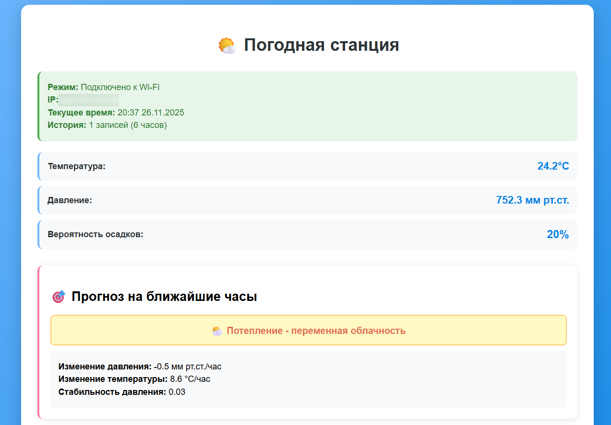
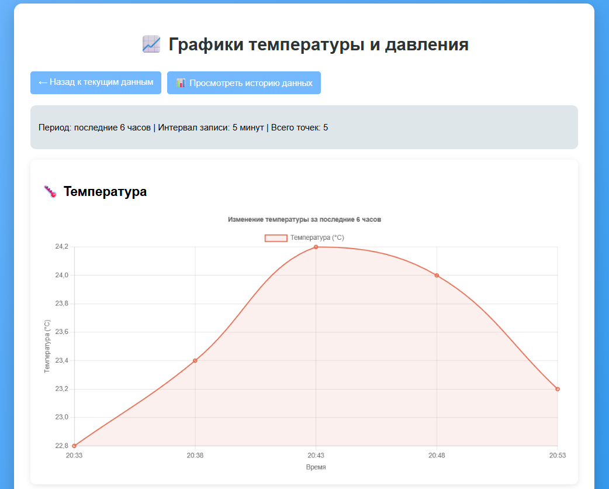
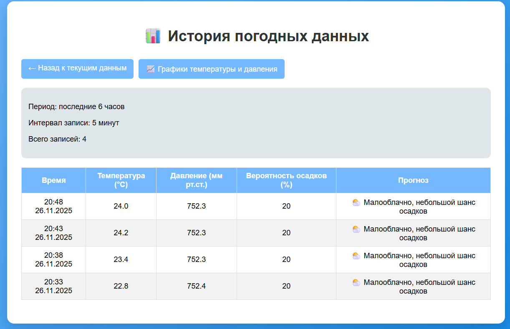

# IoT Weather Station with Predictive Analytics
Этот репозиторий содержит информацию о реализации системы сбора, анализа и визуализации метеорологических данных с возможностью прогнозирования погодных условий на основе анализа временных рядов. Система построена на микроконтроллере ESP32 и включает веб-интерфейс для мониторинга в реальном времени.
## Описание проекта
Существующие сервисы прогноза погоды предоставляют обобщенные данные для больших территорий, но не учитывают микроклиматические особенности конкретной локации. Данная система собирает метеоданные непосредственно с Вашего местоположения, анализирует локальные тенденции и предоставляет персонализированные прогнозы с учетом особенностей Вашего района.
### Цель проекта
- Создание автономной системы сбора и анализа метеоданных
- Разработка алгоритма прогнозирования на основе локальных данных
- Обеспечение точности краткосрочного прогноза >85%
- Создание интуитивного веб-интерфейса для визуализации данных
## Сборка и запуск проекта
### Схема подключения
```
BME280    →    ESP32
--------------------
VCC       →    3.3V
GND       →    GND
SCL       →    GPIO 22
SDA       →    GPIO 21
```
### Настройка программного обеспечения
1. Скачайте и установите Arduino IDE
2. Запустите Arduino IDE
3. Откройте **Файл -> Настройки**
4. В поле **Дополнительные ссылки для Менеджера плат** добавьте:
```https://raw.githubusercontent.com/espressif/arduino-esp32/gh-pages/package_esp32_index.json```
5. В **Менеджере плат** найдите "esp32" и установите "ESP32 by Espressif Systems"
6. Дополнительно установите библиотеку **GyverBME280 by AlexGyver**
### Настройка 
Откройте файл weather_station.ino и найдите секцию с настройками WiFi. Вместо `YOUR_WIFI_SSID` и `YOUR_WIFI_PASSWORD` впишите имя вашей Wi-Fi сети и пароль от вашей Wi-Fi сети соответственно.
```
// Настройки Wi-Fi (замените на свои)
const char* ssid = "YOUR_WIFI_SSID";         // Имя вашей Wi-Fi сети
const char* password = "YOUR_WIFI_PASSWORD"; // Пароль от вашей Wi-Fi сети
```
По желанию можно изменить интервал сбора данных и время хранения данных
```
// Настройки сбора данных (можно оставить по умолчанию)
const unsigned long COLLECTION_INTERVAL = 5 * 60 * 1000; // Интервал сбора данных (5 минут)
const unsigned long HISTORY_DURATION = 6 * 60 * 60 * 1000; // Хранение истории (6 часов)
```
### Запуск проекта
1. Загрузите скетч на ESP32 в Arduino IDE
2. В мониторе порта появится сообщение о подключении к WiFi, ip вашей wifi сети
3. Скопируйте ip вашей wifi сети и вставьте в адресную строку браузера
Готово! Спустя некоторое время Вы увидете прогноз на ближайшие часы.
## Результаты
### Интерфейс

### Граифик температуры

### История данных

